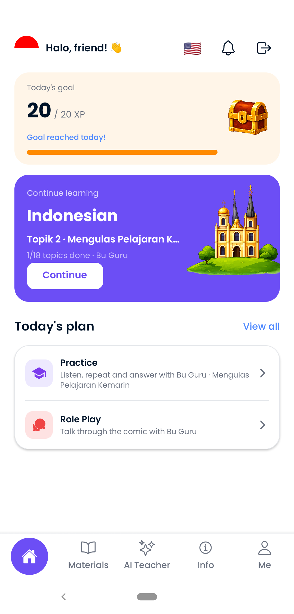
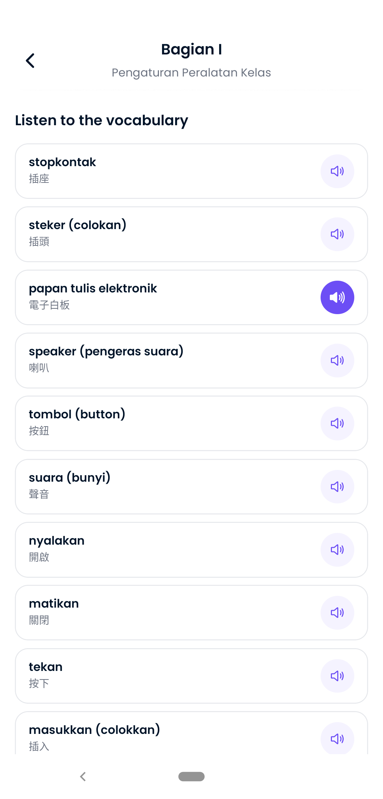
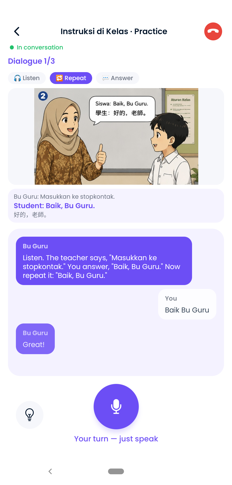
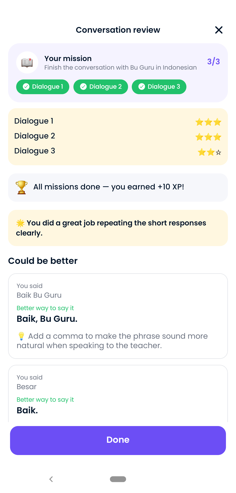
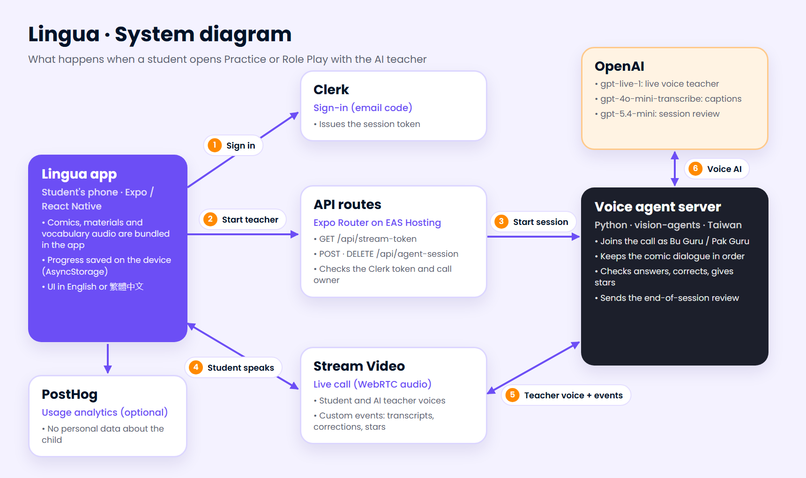
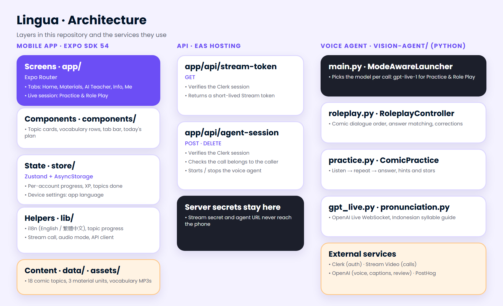

<div align="center">


# Lingua

### The AI Teacher That Helps Children Speak Indonesian

**Live Voice Teacher · Classroom Comics · English / 繁體中文**

---

[](https://expo.dev)
[](https://reactnative.dev)
[](https://www.typescriptlang.org)
[](https://www.python.org)
[](https://platform.openai.com)
[](https://getstream.io)
[](#6-getting-started)

<br/>

> *Children in Taiwan learn Indonesian best by speaking it, not by reading about it.*
> *Lingua turns real classroom comics into live conversations with an AI teacher,*
> *Bu Guru, who listens, corrects gently, and explains in the child's own language.*

<br/>

[**Demo**](#demo) · [**Quick Start**](#6-getting-started) · [**Architecture**](#2-architecture-overview) · [**API Overview**](#9-api-overview)

</div>

---

## Demo

| English | 繁體中文 (Traditional Chinese) |
|:---:|:---:|
| [](docs/media/lingua-demo-en.mp4) | [](docs/media/lingua-demo-zh-TW.mp4) |
| [▶ Watch the English demo (50 s)](docs/media/lingua-demo-en.mp4) | [▶ 觀看中文介紹影片 (63 s)](docs/media/lingua-demo-zh-TW.mp4) |

<p align="center">
  
  
  
  
</p>

---

## 1. Project Overview

Lingua is a mobile app for primary-school students in Taiwan who are learning Bahasa Indonesia. It is built as **one repository with three deployable parts**: an Expo / React Native app, a set of Expo API routes, and a Python voice agent that plays the teacher in live calls.

### Target users

| User | Description |
|------|-------------|
| **Student** | A child (A1 learner) who practises classroom Indonesian by listening, repeating and talking with the AI teacher |
| **Parent / teacher** | Sets up the account, picks the child's nickname and grade, and chooses the teacher's explanation language |
| **School** | Uses the classroom comic topics alongside Indonesian lessons for new-immigrant children |

### Core capabilities

- **Live AI teacher** — Bu Guru or Pak Guru, played in real time by OpenAI `gpt-live-1`
- **Practice mode** — Listen → repeat → answer from memory, with hints, stars and instant corrections
- **Role Play mode** — Act out each comic dialogue as the student, with the AI as the teacher
- **Session review** — Stars per dialogue, praise, and "could be better" tips after every session
- **Learning materials** — Picture lessons with a natural recorded voice for every word (offline)
- **Progress** — Daily XP goal, 18-topic path, and today's plan that always points to the next topic
- **Bilingual UI** — English or Traditional Chinese (Taiwan); lesson content stays in Indonesian
- **Child-safe by design** — Only a nickname and grade are stored; no photos, addresses or real names

---

## 2. Architecture Overview

| Layer | Role | Primary tech |
|-------|------|-------------|
| **Mobile app** | Student UI: tabs, materials, live sessions, progress | Expo SDK 54, React Native 0.81, TypeScript, Expo Router, NativeWind v5 |
| **Client state** | Per-account progress and device settings | Zustand, AsyncStorage |
| **API routes** | Short-lived Stream tokens, starting and stopping the voice agent | Expo Router API routes on EAS Hosting, Clerk backend |
| **Voice agent** | Plays the teacher, keeps the comic in order, checks answers, writes the review | Python 3.12, Stream Vision Agents, OpenAI Live API |
| **Real-time transport** | Audio between the student and the agent, plus custom events | Stream Video (WebRTC) |
| **Auth** | Parent sign-in with an email code | Clerk |
| **Analytics** | Anonymous usage events | PostHog (optional) |

### System diagram



### Architecture



### How a live session works

1. The app asks `/api/stream-token` for a short-lived Stream token and joins a call named `roleplay-<mode>-<topic>-<user>`.
2. It then calls `/api/agent-session`, which checks the Clerk session and that the call belongs to the caller, and starts the voice agent.
3. The agent joins the call as Bu Guru / Pak Guru and talks with `gpt-live-1`.
4. As the child speaks, the agent matches each answer against the comic, corrects mistakes, and sends transcripts, corrections and stars to the app as custom events.
5. At the end, `gpt-5.4-mini` writes a short review in the child's help language.

---

## 3. Key Features

| Feature | Description | Main layer |
|---------|-------------|-----------|
| Practice (練習) | Listen, repeat, then answer from memory; a hint ladder and stars per dialogue | Voice agent + app |
| Role Play (角色扮演) | Speak-style live conversation that follows the classroom comic | Voice agent + app |
| Live corrections | "Try again" card with the missed words highlighted, plus a spoken tip | Voice agent + app |
| Pronunciation guide | Indonesian syllable rules so the teacher never sounds English ("Ha-dir", not "Hai-dir") | Voice agent |
| Session review | Praise and up to three better ways to say it, in English or Chinese | Voice agent |
| Learning materials | Three illustrated units with 22 recorded vocabulary words, playable offline | App |
| Today's plan | Always shows the first AI Teacher topic the child has not started | App |
| Bilingual UI | English / 繁體中文 switch on the home screen | App |
| Teacher settings | Explanation language (Chinese or English) and teacher style | App + voice agent |
| Account-scoped storage | Progress is stored per signed-in account on the device | App |

---

## 4. Tech Stack

| Area | Technology |
|------|-----------|
| **Mobile** | Expo SDK 54, React Native 0.81, TypeScript, Expo Router 6 |
| **Styling** | NativeWind v5, Tailwind CSS |
| **State** | Zustand 5, AsyncStorage |
| **Audio** | expo-audio (vocabulary recordings), react-native-tts (fallback) |
| **Auth** | Clerk (`@clerk/expo`) |
| **Real-time** | Stream Video React Native SDK, Stream Vision Agents |
| **Voice AI** | OpenAI `gpt-live-1` (Practice and Role Play), `gpt-4o-mini-transcribe` (captions) |
| **Review** | OpenAI `gpt-5.4-mini` |
| **Recorded audio** | OpenAI `gpt-4o-mini-tts` (generated once by a script) |
| **API hosting** | EAS Hosting (Expo API routes) |
| **Builds** | EAS Build (Android APK / AAB, iOS) |
| **Voice agent hosting** | Python 3.12 server (Docker / Railway config included) |
| **Analytics** | PostHog |
| **Marketing video** | Remotion 4 (`marketing-video/`) |

---

## 5. Project Structure

```txt
app/                 Routes and screens (Expo Router)
  (tabs)/            Home, Materials, AI Teacher, Info, Me
  roleplay/[id].tsx  Live Practice / Role Play session
  api/               API routes: stream-token, agent-session
components/          Reusable UI (topic cards, vocabulary rows, tab bar, …)
constants/           Theme, images, audio, locales (en, zh-TW)
data/                Classroom comic topics, learning materials, lessons
lib/                 i18n, topic progress, audio mode, API helpers
store/               Zustand stores (learning, language, settings, child profile)
assets/              Images, comics and vocabulary recordings
vision-agent/        Python voice agent (teacher) + tests
scripts/             Content tools (e.g. generate_vocab_audio.py)
marketing-video/     Remotion project for the demo videos and README diagrams
docs/                Deployment notes, requirements, images and demo media
```

---

## 6. Getting Started

### Prerequisites

- Node.js 18+
- Python 3.12+ (for the voice agent)
- An Android device or emulator (or iOS) with a **development build** — voice sessions use native WebRTC and do not run in Expo Go
- Accounts: [Clerk](https://clerk.com), [Stream](https://getstream.io), [OpenAI](https://platform.openai.com)

### 1. Install

```bash
npm install
```

### 2. Environment variables

Copy `.env.example` to `.env` and `vision-agent/.env.example` to `vision-agent/.env`, then fill in your keys (see [Environment Variables](#7-environment-variables)).

### 3. Start the voice agent

```bash
cd vision-agent
pip install "vision-agents[getstream,openai]" python-dotenv
python main.py serve --host 0.0.0.0 --port 8000
```

### 4. Start the app

```bash
npx expo run:android
npx expo start --dev-client
```

On a physical device on the same network, set `VISION_AGENT_URL` to your computer's LAN IP, not `localhost`.

### 5. Run the checks

```bash
npm run lint
npm run typecheck
cd vision-agent && python -m unittest test_pronunciation test_practice test_roleplay test_gpt_live test_secure_server
```

---

## 7. Environment Variables

| Variable | Where | Description |
|----------|-------|-------------|
| `EXPO_PUBLIC_CLERK_PUBLISHABLE_KEY` | `.env` | Clerk publishable key (app) |
| `EXPO_PUBLIC_API_URL` | `.env` | Base URL of the hosted API routes for device builds |
| `STREAM_API_KEY` / `STREAM_API_SECRET` | `.env` | Stream credentials — server only, never sent to the phone |
| `VISION_AGENT_URL` | `.env` | Where the API routes reach the voice agent |
| `AGENT_SERVICE_KEY` | `.env` + `vision-agent/.env` | Optional shared secret for `serve_secure.py` (32+ characters) |
| `POSTHOG_PROJECT_TOKEN` / `POSTHOG_HOST` | `.env` | Optional analytics |
| `OPENAI_API_KEY` | `vision-agent/.env` | OpenAI key for the voice agent and content scripts |
| `ROLEPLAY_LLM` | `vision-agent/.env` | `gpt-live` (default) or `realtime` to fall back to `gpt-realtime-2` |
| `ROLEPLAY_FEEDBACK_MODEL` | `vision-agent/.env` | Model for the session review (default `gpt-5.4-mini`) |
| `EXPO_PUBLIC_AI_TESTING_UNLOCK` | EAS build profile | Unlocks AI for internal test builds only (`preview-ai-testing`) |

---

## 8. Scripts

```bash
# App
npm start                        # Expo dev server
npm run android                  # Native Android build and run
npm run lint                     # ESLint
npm run typecheck                # TypeScript

# Builds and deploys
npm run build:android:preview    # EAS APK for testers
npm run build:android:prod       # EAS AAB for the store
npm run deploy:api               # API routes to EAS Hosting (production)

# Content
vision-agent/.venv/Scripts/python.exe scripts/generate_vocab_audio.py   # Record vocabulary audio

# Demo video and diagrams (in marketing-video/)
npx remotion render IntroVideo out/lingua-intro-vertical-en.mp4
npx remotion render IntroVideo-zhTW out/lingua-intro-vertical-zh-TW.mp4
npx remotion still SystemDiagram ../docs/images/system-diagram.png
```

---

## 9. API Overview

### App API routes (EAS Hosting)

| Method | Route | Description |
|--------|-------|-------------|
| `GET` | `/api/stream-token` | Verifies the Clerk session and returns a short-lived Stream user token |
| `POST` | `/api/agent-session` | Verifies the caller owns the call, then asks the voice agent to join it |
| `DELETE` | `/api/agent-session` | Ends the voice agent session for that call |

### Voice agent (Python)

| Method | Route | Description |
|--------|-------|-------------|
| `POST` | `/calls/{call_id}/sessions` | Start an agent in the given Stream call |
| `DELETE` | `/calls/{call_id}/sessions/{session_id}` | Stop that agent |
| `GET` | `/health` | Health check |

The call id decides the mode: `roleplay-practice-*` runs Practice and `roleplay-comic-*` runs Role Play, both on `gpt-live-1`.

---

## 10. Deployment

- **API routes** → EAS Hosting: `npm run deploy:api`
- **Voice agent** → any Python host; Docker and Railway configs are in `vision-agent/`. Our pilot server setup is described in [docs/VOICE-SERVER-TAIWAN.md](docs/VOICE-SERVER-TAIWAN.md).
- **App** → EAS Build profiles in `eas.json` (`preview`, `preview-ai-testing`, `production`)

Step-by-step guides: [DEPLOY_NOW.md](DEPLOY_NOW.md) and [DEPLOYMENT.md](DEPLOYMENT.md).

---

## 11. Privacy and Child Safety

- The app stores only a nickname and grade for the child; sign-in belongs to the parent.
- Learning progress stays on the device; there is no app database.
- Secrets (Stream secret, agent URL, OpenAI key) live only on the servers.
- AI features stay closed in student builds until the release checklist in [docs/REQUIREMENTS-DISTRIBUSI-SD.md](docs/REQUIREMENTS-DISTRIBUSI-SD.md) is complete.

---

## 12. Acknowledgements

The first version of the app scaffold was based on JS Mastery's React Native Lingua tutorial project. Everything Indonesian-specific — the classroom comic curriculum, the live AI teacher, Practice and Role Play, bilingual UI, and the voice agent — was built on top of it for this project.

## 13. License

No open-source license has been chosen yet, so all rights are reserved by the author. Please ask before reusing the code or content.
